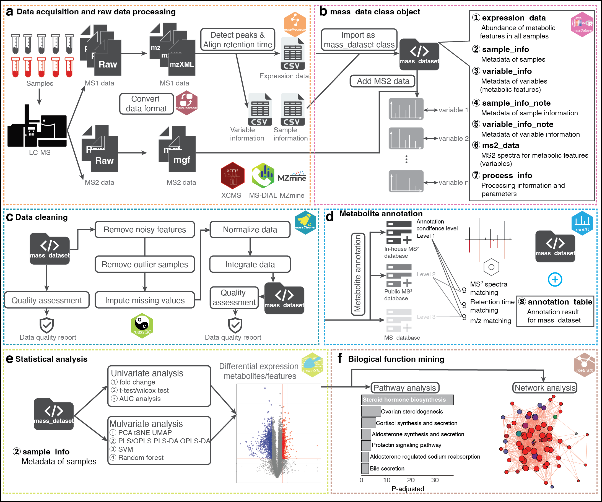

<!-- README.md is generated from README.Rmd. Please edit that file -->

## `Tidymass`: An Object-oriented Reproducible Analysis Framework for LC-MS Data 

[](https://cran.r-project.org/package=tidymass)
[](https://github.com/tidymass/tidymass)
[](https://cran.r-project.org/package=tidymass)
[](https://www.tidyverse.org/lifecycle/#experimental)

<br>

<h2 style="color:red;"><i class="fas fa-info-circle"> About</h2>

---


`TidyMass` project is a comprehensive computational framework that can process the whole workflow of data processing and analysis for LC-MS-based untargeted metabolomics. 

`TidyMass` was designed based on the following strategies to address the limitations of current tools. 

**(1) Cross-platform utility**

**(2) Uniform, shareable, traceable, and reproducible**



<br>

**Analysis workflow of `tidyMass`**

---


<br>

**The `mass_dataset` class and its property**

<h2 style="color:red;"><i class="fas fa-cloud-download-alt"> Installation</h2>

---

You can install `tidymass` from
[GitHub](https://github.com/tidymass/tidymass), [GitLab](https://gitlab.com/dashboard/projects) or [Gitee](https://gitee.com/jaspershen/projects).

Option 1: GitHub

``` r
if(!require(remotes)){
install.packages("remotes")
}
remotes::install_github("tidymass/tidymass")
```

Option 2: GitLab

``` r
remotes::install_gitlab("jaspershen/tidymass")
```

Option 3: Gitee

``` r
remotes::install_git(url = "https://gitee.com/jaspershen/tidymass", dependencies = TRUE)
```

> More information can be found [here](https://tidymass.github.io/tidymass/articles/tidymass_install.html).

<h2 style="color:red;"><i class="fas fa-question-circle"> Need help?</h2>

---

If you have any questions about `tidymass`, please don’t hesitate to
email me (<shenxt@stanford.edu>) or reach out me via the social medias below.

<i class="fa fa-weixin"></i>  [shenxt1990](https://www.shenxt.info/files/wechat_QR.jpg)

<i class="fa fa-envelope"></i>  <shenxt@stanford.edu>

<i class="fa fa-twitter"></i>  [Twitter](https://twitter.com/xiaotaoshen1990)

<h2 style="color:red;"><i class="fas fa-location-arrow"> Citation</h2>

---

If you use `tidymass` in you publications, please cite this publication:

X. Shen, R. Wang, X. Xiong, Y. Yin, Y. Cai, Z. Ma, N. Liu, and Z.-J.
Zhu\* (Corresponding Author), Metabolic Reaction Network-based Recursive
Metabolite Annotation for Untargeted Metabolomics, Nature
Communications, 2019, 10: 1516.  
[Web Link](https://www.nature.com/articles/s41467-019-09550-x).

Thank you very much!
