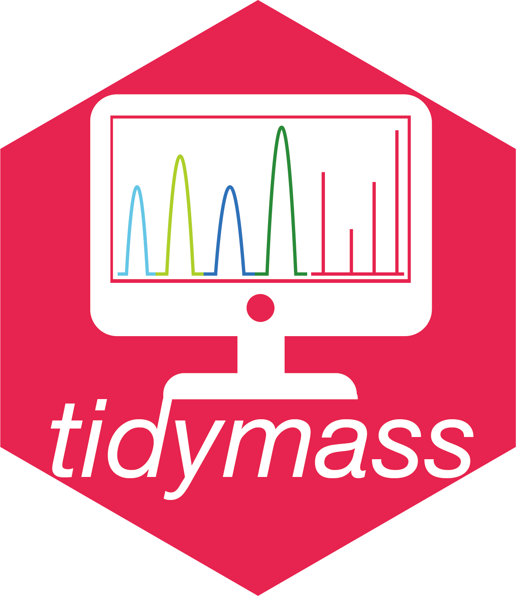

<!-- README.md is generated from README.Rmd. Please edit that file -->

## `tidymass`: An R package to organize all the packages in tidyMass project 

[](https://cran.r-project.org/package=tidymass)
[](https://github.com/tidymass/tidymass)
[](https://cran.r-project.org/package=tidymass)
[](https://www.tidyverse.org/lifecycle/#experimental)

`tidymass` is a part of [tidymass project](https://www.tidymass.org/).

# **About**

`tidymass` is a R package which is used to manage and organize all the pacakges in [tidyMass project](https://www.tidymass.org/)

# **Installation**

You can install `tidymass` from [GitLab](https://gitlab.com/tidymass/tidymass)

``` r
if(!require(remotes)){
install.packages("remotes")
}
remotes::install_gitlab("tidymass/tidymass")
```

or [GitHub](https://github.com/tidymass/tidymass)

``` r
remotes::install_github("tidymass/tidymass")
```

# **Usage**

Please see the `Help documents` page to get the instruction of `tidymass`.


# **Need help?**

If you have any quesitions about `tidymass`, please don’t hesitate to
email me (<shenxt@stanford.edu>).

<i class="fa fa-weixin"></i>
[shenzutao1990](https://www.shenxt.info/files/wechat_QR.jpg)

<i class="fa fa-envelope"></i> <shenxt@stanford.edu>

<i class="fa fa-twitter"></i>
[Twitter](https://twitter.com/JasperShen1990)

<i class="fa fa-map-marker-alt"></i> [M339, Alway building, Cooper Lane,
Palo Alto,
CA 94304](https://www.google.com/maps/place/Alway+Building/@37.4322345,-122.1770883,17z/data=!3m1!4b1!4m5!3m4!1s0x808fa4d335c3be37:0x9057931f3b312c29!8m2!3d37.4322345!4d-122.1748996)

# **Citation**

If you use `tidymass` in your publications, please cite this paper:

Shen, X., Yan, H., Wang, C. et al. TidyMass an object-oriented reproducible analysis framework for LC–MS data. Nat Commun 13, 4365 (2022). 

[Weblink](https://www.nature.com/articles/s41467-022-32155-w)

Thanks very much!
