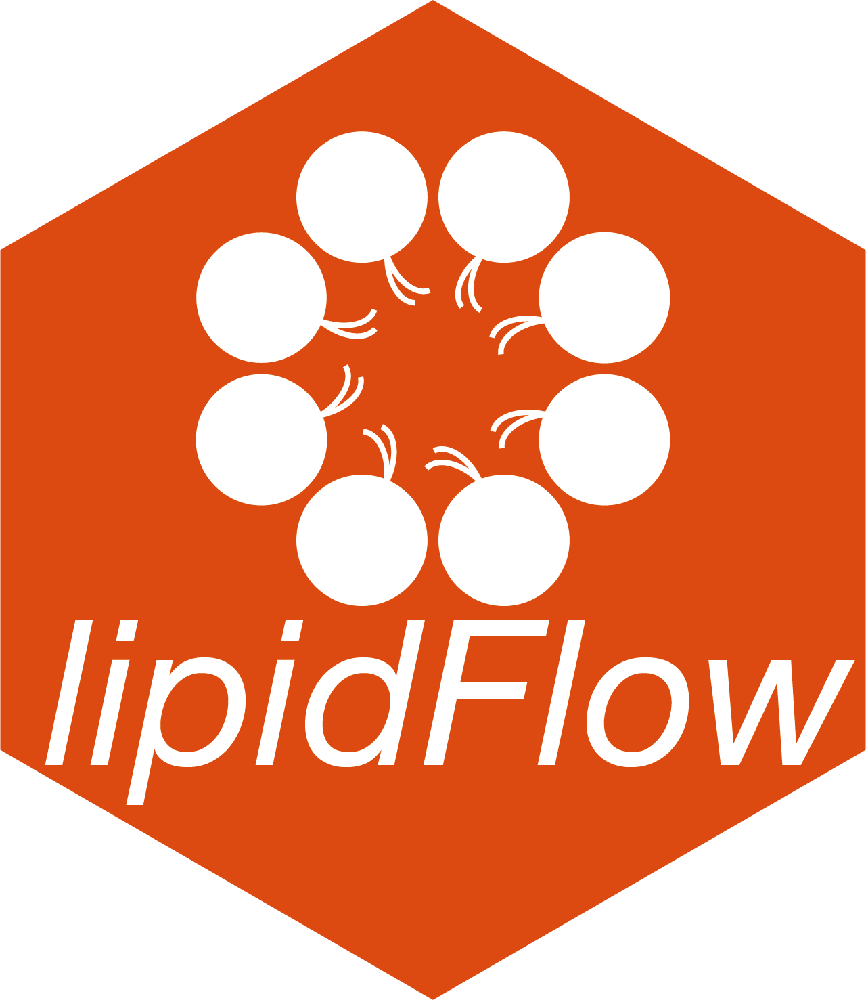

<!-- README.md is generated from README.Rmd. Please edit that file -->

# tidymass 

[](https://cran.r-project.org/package=tidymass)
[](https://github.com/jaspershen/tidymass)
[](https://cran.r-project.org/package=tidymass)
[](https://www.tidyverse.org/lifecycle/#experimental)

## About

`tidymass` is a collections of R packages for mass spectrometry data
processing, analysis.


## Installation

You can install `tidymass` from
[Github](https://github.com/jaspershen/tidymass).

``` r
if(!require(devtools)){
install.packages("devtools")
}
devtools::install_github("jaspershen/tidymass")
```

Then you can use `install_tidymass()` to install all the packages in
`tidymass`.

``` r
library(tidymass)
```

``` r
tidymass::install_tidymass(from = "github", force = FALSE)
```

## Usage

Now, `tidymass` contains several packages:

### metflow2 <a href="https://jaspershen.github.io/metflow2/" target="_blank"></a>

<br>

`metflow2` is a R package which is used for untargeted metabolomics data processing and analysis.  

<br>

### MetNormalizer <a href="https://jaspershen.github.io/MetNormalizer/" target="_blank"></a>

<br>

`MetNormalizer` is used for metabolomics data normalization and integration based on SVM.

<br>

### metID <a href="https://jaspershen.github.io/metID/" target="_blank"></a>

<br>

`metID` is used metabolite database construction and metabolite annotation.

<br>

### lipidflow <a href="https://jaspershen.github.io/lipidflow/" target="_blank"></a>

<br>

`lipidflow` is used absolute quantification for lipidomics data.

<br>

### metPath <a href="https://jaspershen.github.io/metpath/" target="_blank"></a>

<br>

`metPath` is used for pathway enrichment analysis.

<br>

### featureGSEA <a href="https://jaspershen.github.io/featureGSEA/" target="_blank"></a>

<br>

`featureGSEA` is used for GSEA from metabolic feature without annotation.

<br>

## Need help?

If you have any questions about `tidymass`, please don’t hesitate to
email me (<shenxt@stanford.edu>) or reach out me via the social medias below.

<i class="fa fa-weixin"></i>
[shenxt1990](https://www.shenxt.info/files/wechat_QR.jpg)

<i class="fa fa-envelope"></i> <shenxt@stanford.edu>

<i class="fa fa-twitter"></i>
[Twitter](https://twitter.com/JasperShen1990)

<i class="fa fa-map-marker-alt"></i> [M339, Alway Buidling, Cooper Lane,
Palo Alto, CA
94304](https://www.google.com/maps/place/Alway+Building/@37.4322345,-122.1770883,17z/data=!3m1!4b1!4m5!3m4!1s0x808fa4d335c3be37:0x9057931f3b312c29!8m2!3d37.4322345!4d-122.1748996)

## Citation

If you use tidymass in you publication, please cite this publication:

X. Shen, R. Wang, X. Xiong, Y. Yin, Y. Cai, Z. Ma, N. Liu, and Z.-J.
Zhu\* (Corresponding Author), Metabolic Reaction Network-based Recursive
Metabolite Annotation for Untargeted Metabolomics, Nature
Communications, 2019, 10: 1516.  
[Web Link](https://www.nature.com/articles/s41467-019-09550-x).

Thanks very much!
