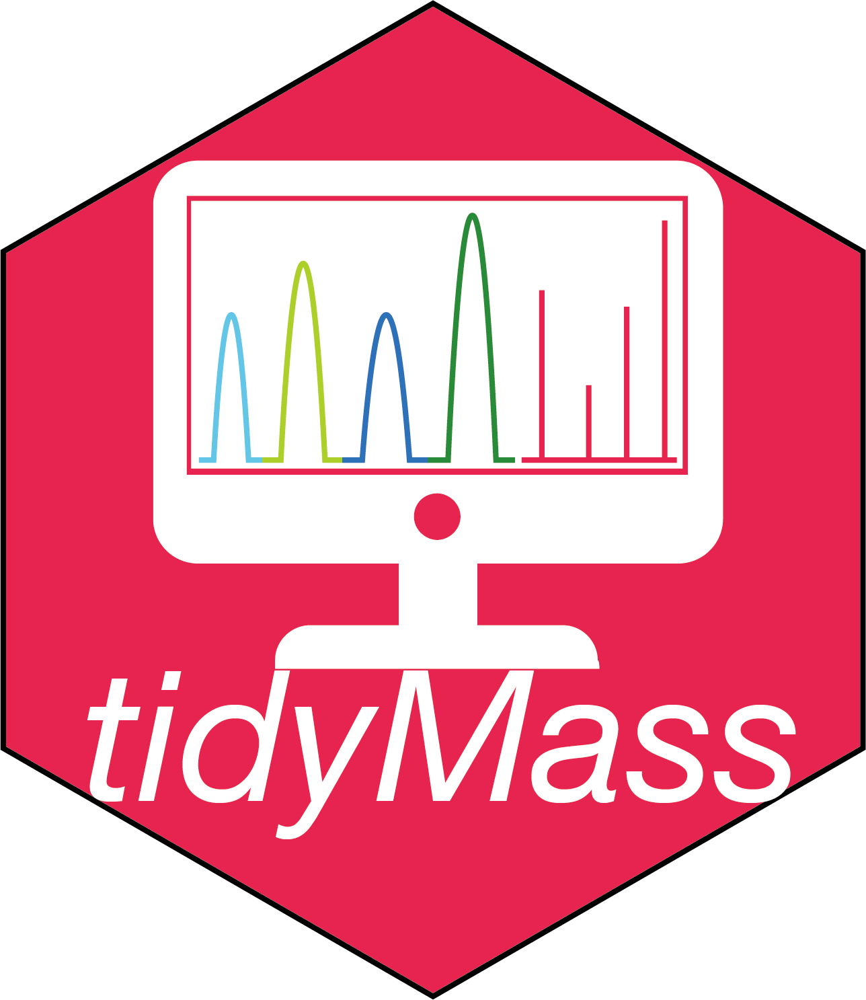
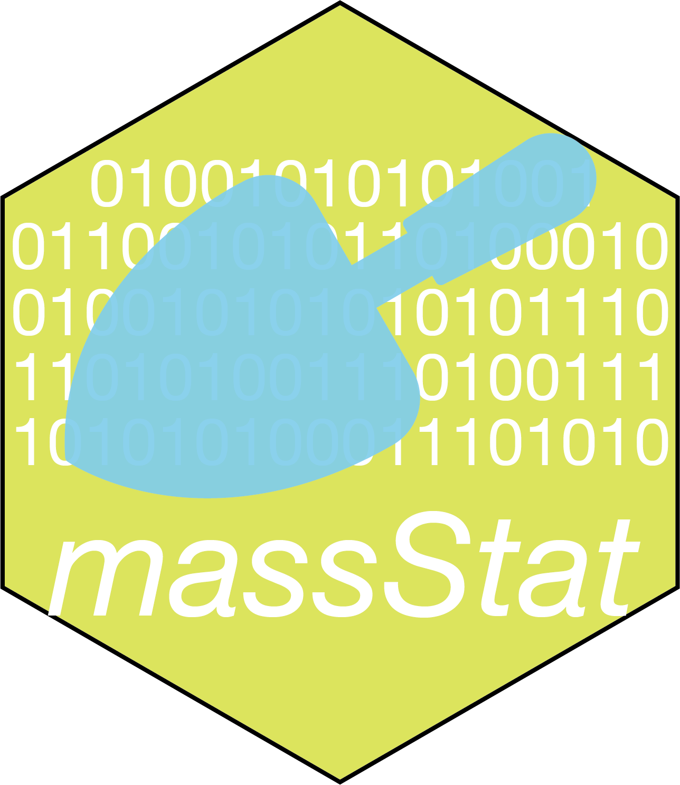

<!-- README.md is generated from README.Rmd. Please edit that file -->

# `tidymass`: R packages for MS data processing and analysis 

[](https://cran.r-project.org/package=tidymass)
[](https://github.com/tidymass/tidymass)
[](https://cran.r-project.org/package=tidymass)
[](https://www.tidyverse.org/lifecycle/#experimental)

<br>

<h2 style="color:red;"><i class="fas fa-info-circle"> About</h2>

---


The `tidymass` is a collection of R packages designed for LC-MS-based untargeted metabolomics data processing. All packages share an underlying design philosophy, grammar, and data structures.

`Tidymass` is a comprehensive computational framework for MS-based untargeted metabolomics data processing and analysis, including raw data processing (peak detecting), data cleaning (missing value processing, data normalization, and integration), statistical analysis, metabolite annotation, and biological function mining (pathway enrichment, feature-based metabolic module analysis).

<br>

<h2 style="color:red;"><i class="fas fa-cloud-download-alt"> Installation</h2>

---

You can install `tidymass` from
[GitHub](https://github.com/tidymass/tidymass).

``` r
if(!require(devtools)){
install.packages("devtools")
}
devtools::install_github("tidymass/tidymass")
```

Then you can use `tidymass_install()` to install all the packages in
`tidymass`.

``` r
library(tidymass)
```

``` r
tidymass::tidymass_install(from = "github", force = FALSE)
```

<h2 style="color:red;"><i class="fas fa-code-branch"> Packages</h2>

---

Now, `tidymass` contains 9 packages, which are listed below:

<h3 style="color:#b45c6c;"><i class="fas fa-code"> massConverter</h3> <a href="https://tidymass.github.io/massconverter/" target="_blank"></a>

<br>

`massconverter` is used to convert mass spectrometry raw data to other format data (mzXML, mxML, etc.).

<br>

<h3 style="color:#e474ac;"><i class="fas fa-code"> massDataset</h3> <a href="https://tidymass.github.io/massdataset/" target="_blank"></a>

<br>

`massdataset` is used organize metabolomics experiment data into a `mass_dataset` class object, that can be processed by all the `tidymass` packages.

<br>

<h3 style="color:#f4ac64;"><i class="fas fa-code"> massProcesser</h3> <a href="https://tidymass.github.io/massprocesser/" target="_blank"></a>

<br>

`massprocesser` is used for LC-MS based untargeted metabolomics raw data processing.

<br>

<h3 style="color:#2098b8;"><i class="fas fa-code"> massCleaner</h3> <a href="https://tidymass.github.io/masscleaner/" target="_blank"></a>

<br>

`masscleaner` is used for data cleaning of metabolomics.

<br>
<br>

<h3 style="color:#abcc2c;"><i class="fas fa-code"> massQC</h3> <a href="https://tidymass.github.io/massqc/" target="_blank"></a>

<br>

`massqc` is used for data quality assessment and control.

<br>
<br>

<h3 style="color:#2ca4e4;"><i class="fas fa-code"> metID</h3> <a href="https://tidymass.github.io/metid/" target="_blank"></a>

<br>

`metid` is used for metabolite database construction and metabolite annotation.

<br>
<br>

<h3 style="color:#dce45c;"><i class="fas fa-code"> massStat</h3> <a href="https://tidymass.github.io/massstat/" target="_blank"></a>

<br>

`massstat` is used for statistical analysis of untargeted metabolomics.

<br>
<br>

<h3 style="color:#ccac9c;"><i class="fas fa-code"> metPath</h3> <a href="https://tidymass.github.io/metpath/" target="_blank"></a>


<br>

`metpath` is used for pathway enrichment analysis of metabolomics data.

<br>
<br>

<h3 style="color:#ec1c04;"><i class="fas fa-code"> massTools</h3> <a href="https://tidymass.github.io/masstools/" target="_blank"></a>

<br>

`masstools` is a collection of useful tiny tools for mass spectrometry data processing and analysis.

<br>

<h2 style="color:red;"><i class="fas fa-question-circle"> Need help?</h2>

---

If you have any questions about `tidymass`, please don’t hesitate to
email me (<shenxt@stanford.edu>) or reach out me via the social medias below.

<i class="fa fa-weixin"></i>  [shenxt1990](https://www.shenxt.info/files/wechat_QR.jpg)

<i class="fa fa-envelope"></i>  <shenxt@stanford.edu>

<i class="fa fa-twitter"></i>  [Twitter](https://twitter.com/xiaotaoshen1990)

<i class="fa fa-map-marker-alt"></i>  [M339, Alway Buidling, Cooper Lane,
Palo Alto, CA
94304](https://www.google.com/maps/place/Alway+Building/@37.4322345,-122.1770883,17z/data=!3m1!4b1!4m5!3m4!1s0x808fa4d335c3be37:0x9057931f3b312c29!8m2!3d37.4322345!4d-122.1748996)

<h2 style="color:red;"><i class="fas fa-location-arrow"> Citation</h2>

---

If you use tidymass in you publications, please cite this publication:

X. Shen, R. Wang, X. Xiong, Y. Yin, Y. Cai, Z. Ma, N. Liu, and Z.-J.
Zhu\* (Corresponding Author), Metabolic Reaction Network-based Recursive
Metabolite Annotation for Untargeted Metabolomics, Nature
Communications, 2019, 10: 1516.  
[Web Link](https://www.nature.com/articles/s41467-019-09550-x).

Thank you very much!
