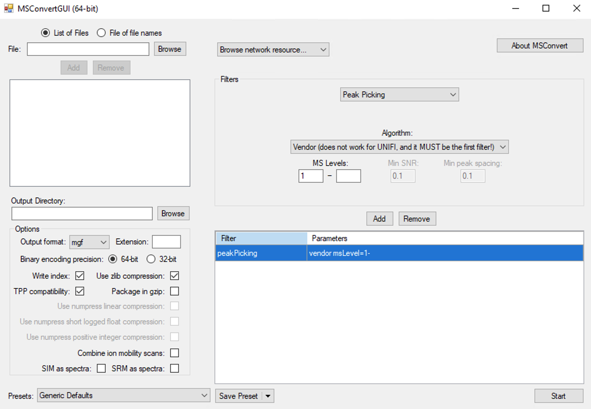

```{r, include = FALSE, echo=FALSE}
knitr::opts_chunk$set(
  collapse = TRUE,
  comment = "#>",
  warning = FALSE,
  message = TRUE,
  out.width = "100%"
)
```

# **Data preparation**

Please place the raw data in one folder according to MS1 and MS2. Then you can convert them using `Proteowizard` or `massconverter` package.

# **Proteowizard**

## Convert MS1 data to `mzXML` format data

Just convert data into `mzXML` format data according to the parameters below:


## Convert MS2 data to `mzXML` or `mgf` format data

Just convert data into `mzXML` or `mgf` format data according to the parameters below:



# **Convert data using `massconverter`**

`massconverter` is a package in `tidymass` project which can be used to convert mass spectrometry raw data based on docker image of [`pwid`](https://hub.docker.com/r/chambm/pwiz-skyline-i-agree-to-the-vendor-licenses). See more information [here](https://tidymass.github.io/massconverter/).

More inforamtion can be found [here](https://tidymass.github.io/massconverter/articles/convert_data.html).

# **Session information**

```{r,eval=TRUE,warning=FALSE, R.options="", message=FALSE, cache=TRUE}
sessionInfo()
```
